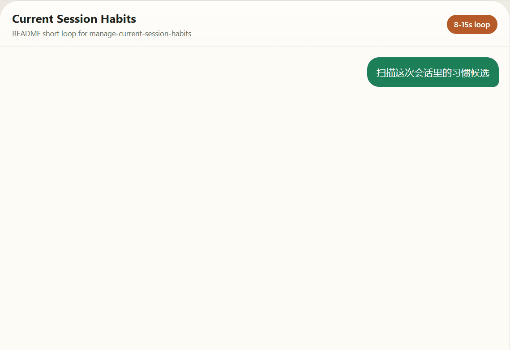

# User Habit Pipeline

`user-habit-pipeline` is a local-first AI shorthand interpreter for Codex, local AI tools, and app workflows that need to turn repeated user phrases into structured, reviewable intent hints.

Use it when a host keeps seeing phrases like `继续`, `收尾一下`, or `验收` and you want explicit, inspectable interpretation instead of brittle regex glue or hidden memory.



Fastest entrypoints:

- npm package: `npm install user-habit-pipeline`
- outside-project demo: [user-habit-pipeline-codex-demo](https://github.com/pingzi-crypto/user-habit-pipeline-codex-demo)
- Codex skill: [manage-current-session-habits](https://github.com/pingzi-crypto/manage-current-session-habits)

It works well for AI assistant user-habit interpretation, chat command normalization, current-session habit scanning, and prompt or workflow hinting without hidden execution.

## In One Line

Use `user-habit-pipeline` when an AI assistant or local app keeps seeing repeated user phrases and you want explicit, inspectable interpretation instead of brittle regex glue or hidden memory.

## Who It Is For

Use this package if you are building:

- an AI assistant that needs explicit user-habit memory with confirmation controls
- a Node.js product that needs stable shorthand interpretation
- a local tool that wants JSON output instead of brittle regex glue
- a chat or assistant host that wants current-session habit suggestions
- a workflow layer that needs hints, not auto-executed actions

## Search-Friendly Use Cases

- local AI assistant memory for repeated user shorthand
- Codex skill backend for current-session habit suggestions
- prompt parser for follow-up commands like `继续`, `停`, `收尾一下`
- reviewable user preference interpretation without auto-executing workflows
- localhost intent service for desktop tools, Electron apps, and local automation

## Common Use Cases

Interpret one ambiguous shorthand message into structured intent data:

```powershell
npx user-habit-pipeline --message "继续" --scenario general
```

Add one user-defined phrase without editing shipped defaults:

```powershell
npx manage-user-habits --request "添加用户习惯短句: phrase=收尾一下; intent=close_session; 场景=session_close; 置信度=0.86"
```

Scan a current conversation for candidate habit phrases:

```powershell
@'
user: 以后我说“收尾一下”就是 close_session
assistant: 收到。
user: 收尾一下
'@ | npx codex-session-habits --request "扫描这次会话里的习惯候选" --thread-stdin
```

## Quick Start

Install from npm:

```powershell
npm install user-habit-pipeline
```

Fastest external demo:

- [user-habit-pipeline-codex-demo](https://github.com/pingzi-crypto/user-habit-pipeline-codex-demo) shows a clean outside project using the published package, auto-scaffolding the Codex host starter, and running a local `scan -> apply` flow with isolated runtime state.

Generate a copyable starter for another project:

```powershell
npx user-habit-pipeline-init-consumer --host node --out .\habit-pipeline-starter
```

Interpret a shorthand phrase:

```powershell
npx user-habit-pipeline --message "收尾一下" --scenario session_close
```

## Platform Support

The package is designed for local-first use across major desktop/server environments.

Current verified matrix:

- Windows with Node.js 18+
- macOS with Node.js 18+
- Linux with Node.js 18+

The repository CI now runs the same `release-check` flow on `windows-latest`, `macos-latest`, and `ubuntu-latest`, including packaging smoke and installed-package validation.

## What You Get

- a CLI and library for shorthand interpretation
- a separate user overlay for add/remove habit phrases without editing shipped defaults
- current-session habit suggestion scanning for Codex-style chat flows
- stable structured output for downstream systems

Example output:

```json
{
  "normalized_intent": "close_session",
  "habit_matches": [
    {
      "phrase": "收尾一下",
      "meaning": "close_session",
      "confidence": 0.86
    }
  ],
  "disambiguation_hints": [],
  "confidence": 0.86,
  "should_ask_clarifying_question": false
}
```

## Integration Paths

Node.js / TypeScript library use:

```ts
import { interpretHabit } from "user-habit-pipeline";

const result = interpretHabit({
  message: "继续",
  scenario: "general",
  recent_context: ["继续当前评审"]
});
```

CLI use:

```powershell
npx user-habit-pipeline --message "更新入板" --scenario status_board
```

User phrase management:

```powershell
npx manage-user-habits --list
npx manage-user-habits --request "删除用户习惯短句: 收尾一下"
```

Current-session scan for chat or assistant hosts:

```powershell
@'
user: 以后我说“收尾一下”就是 close_session
assistant: 收到。
user: 收尾一下
'@ | npx codex-session-habits --request "扫描这次会话里的习惯候选" --thread-stdin
```

Copyable external-project templates:

- Node: `examples/external-consumer-node/`
- Python: `examples/external-consumer-python/`
- Current-session host: `examples/current-session-host-node/`
- Public external demo repo: [pingzi-crypto/user-habit-pipeline-codex-demo](https://github.com/pingzi-crypto/user-habit-pipeline-codex-demo)

Starter generator for target projects:

```powershell
npx user-habit-pipeline-init-consumer --host node --out .\habit-pipeline-starter
npx user-habit-pipeline-init-consumer --host python --out .\habit-pipeline-python-starter
npx user-habit-pipeline-init-consumer --host codex --out .\habit-pipeline-codex-starter
```

Official local HTTP entrypoint for localhost integration:

```powershell
npx user-habit-pipeline-http --port 4848
```

Embedded HTTP server from Node.js:

```js
const { startHttpServer } = require("user-habit-pipeline");

const { url, server } = await startHttpServer({
  host: "127.0.0.1",
  port: 4848
});

console.log(url);
// later: server.close()
```

Generate a custom project-registry starter:

```powershell
npx user-habit-pipeline-init-registry --out .\my-project-registry
```

## Runtime State

Runtime user state is stored outside the package directory by default:

- Windows: `%APPDATA%\user-habit-pipeline\user_habits.json`
- non-Windows: `~/.config/user-habit-pipeline/user_habits.json`

This keeps installed package files read-only and makes local npm installs safer to reuse across projects.

## Product Boundary

This package:

- interprets shorthand
- returns inspectable structured hints
- helps the host decide whether clarification is needed

This package does not:

- execute workflow actions
- auto-learn into active habits during scan-only flows
- silently write durable user rules without explicit confirmation

## Docs

Start here if you need more than the quick start:

- [API Reference](https://github.com/pingzi-crypto/user-habit-pipeline/blob/main/docs/api-reference.md)
- [Integration Quickstart](https://github.com/pingzi-crypto/user-habit-pipeline/blob/main/docs/integration-quickstart.md)
- [Registry Authoring](https://github.com/pingzi-crypto/user-habit-pipeline/blob/main/docs/registry-authoring.md)
- [User Habit Management](https://github.com/pingzi-crypto/user-habit-pipeline/blob/main/docs/user-habit-management.md)
- [Session Habit Suggestions](https://github.com/pingzi-crypto/user-habit-pipeline/blob/main/docs/session-habit-suggestions.md)
- [Codex Current-Session Contract](https://github.com/pingzi-crypto/user-habit-pipeline/blob/main/docs/codex-current-session-contract.md)
- [Confidence Scoring](https://github.com/pingzi-crypto/user-habit-pipeline/blob/main/docs/confidence-scoring.md)

## License

Apache License 2.0. See [LICENSE](https://github.com/pingzi-crypto/user-habit-pipeline/blob/main/LICENSE).
